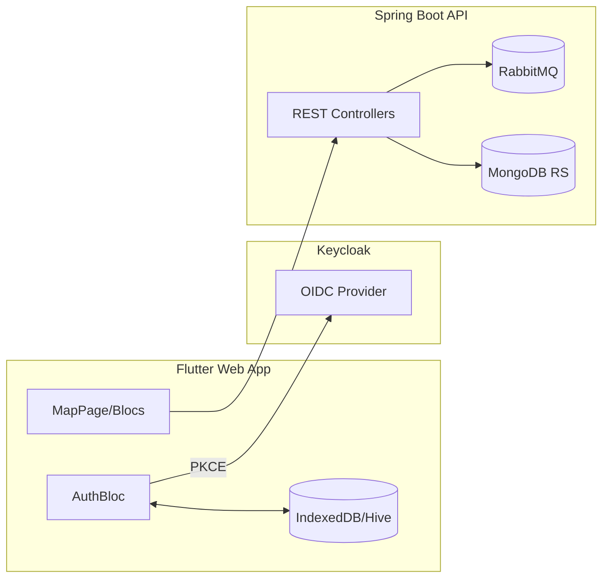

# ResistanceMaps

A monorepo containing:

- `resistance-maps/`: Flutter Web application (dark theme, flutter_map, Bloc, OIDC via PKCE)
- `backend/`: Spring Boot (Kotlin) API
- `infra/`: Docker Compose for Keycloak, Mongo (replica set), RabbitMQ, and backend

## Quick start

1. Infrastructure

```bash
cd infra
# Start Keycloak, Mongo RS, RabbitMQ, Backend
docker compose up -d
```

2. Flutter Web app

```bash
cd resistance-maps
# Run in Chrome with path URL strategy
flutter run -d chrome --web-hostname localhost --web-port 7357 \
  --dart-define=API_BASE=http://localhost:8080 \
  --dart-define=OIDC_ISSUER_PUBLIC=http://localhost:8081/realms/resistance \
  --dart-define=OIDC_CLIENT_ID=resistance-mobile \
  --dart-define=OIDC_REDIRECT_URI=
```

Notes:

- If `OIDC_REDIRECT_URI` is empty, the app will auto-derive `http://<origin>/callback` on web.
- Ensure Keycloak Client `resistance-mobile` has:
  - Valid Redirect URIs: `http://localhost:7357/callback`
  - Web Origins: `+` (or explicit `http://localhost:7357`)

## Environment variables

- API_BASE: Backend base URL (e.g., `http://localhost:8080`)
- OIDC_ISSUER_PUBLIC: Keycloak issuer public base (e.g., `http://localhost:8081/realms/resistance`)
- OIDC_CLIENT_ID: Keycloak public client (default: `resistance-mobile`)
- OIDC_REDIRECT_URI: Optional override (web); default resolves to `origin/callback`

## Security best practices

- Use PKCE-based OIDC (as implemented) – avoid password grant and admin credentials in the client.
- Restrict Keycloak Redirect URIs to exact origins in non-dev.
- Avoid wildcards for CORS in production; specify exact `Web Origins`.
- Never commit secrets; provide `*.example` templates instead of real `.env` files.
- Keep dependencies updated; watch for container base image CVEs.
- Limit token scope to `openid profile email` unless required.
- Store tokens client-side only as needed; refresh on 401 rather than long-lived tokens.

## Backend best practices

- Set proper JVM target (17+) in Gradle; align with Docker base image JDK.
- Externalize config via env vars (already wired in `docker-compose.yml`).
- Use request logging with care; never log full JWTs.
- Validate and sanitize inputs; enforce auth via resource server or gateway.

## Flutter app best practices

- Bloc for auth/markers, centralized `AuthBloc` with Hive persistence.
- Use `AuthInterceptor` to attach tokens and refresh on 401.
- Prefer `flutter_map` with single-host OSM tiles (no subdomains).
- Localize UI with i18next; keep keys short and grouped.

## Local data and repos

- IndexedDB (web) stores session via Hive box `app` → key `session`.
- Mongo runs as RS with three containers; avoid local bind mounts for data in repo.

## Architecture (Mermaid)



## Troubleshooting

- Token exchange CORS errors:
  - Ensure Keycloak Web Origins includes your app origin (e.g., `http://localhost:7357`).
  - Check that the `/callback` URL is in Valid Redirect URIs.
- Popup returns but user still logged out:
  - Confirm the callback page posts the URL back and that the parent receives it (Console).
  - Check IndexedDB → `app` → `session` is present after login.
- Map tiles slow or warnings:
  - Use `https://tile.openstreetmap.org/{z}/{x}/{y}.png` (no subdomains).
